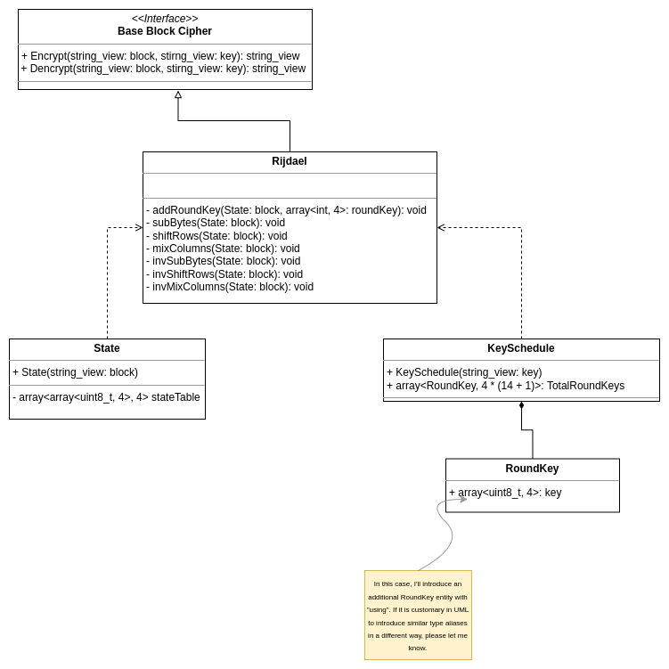

# AES

Implementation of AES (Rijndael) block cipher. This implementation is made using C++17. The algorithm is developed in
accordance with the FIPS publication 197. Algorithm developed as part of an educational project.

### Build
The project is a library that needs to be built using CMakeFile.txt.
Also, you can build tests using TESTING option.

### TO DO:
I want to add some usage examples and stress tests for this project soon.

At the moment the actual architecture looks like this:

