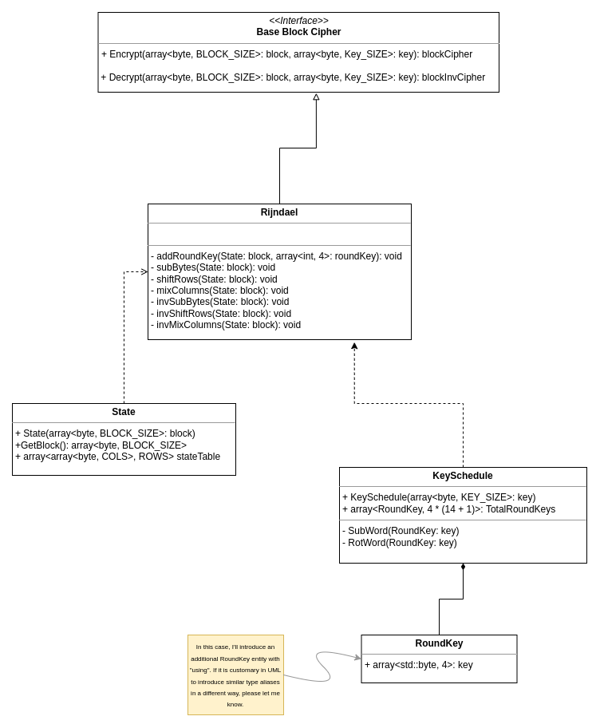

# AES

Implementation of AES (Rijndael) block cipher. This implementation is made using C++17. The algorithm is developed in
accordance with the FIPS publication 197. Algorithm developed as part of an educational project.

At the moment the architecture looks like this:

However, I have my doubts about some over-engineering in extracting the Block and Key entities. If you have any thoughts
on how you can do without the block and key entities and still be able to extend the functionality with other encryption
algorithms using the BaseBlockCipher interface, please let me know.